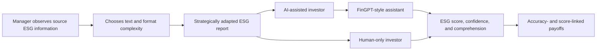

# GenAI, ESG Disclosure, and Investor Decisions

An exploratory laboratory study of how generative AI changes both sides of ESG information exchange: managers' disclosure strategies and investors' judgment.

This repository accompanies my 2026 bachelor's thesis at Zhejiang University, *ESG Disclosure Strategies and Investor Decision-Making with GenAI* (`GenAI 介入下的 ESG 披露策略与投资者决策行为研究`).

> [!NOTE]
> The thesis was written in Chinese. If you are interested in an English version, an AI assistant can help translate and read the [Chinese thesis PDF](./paper/GenAI_ESG_Bachelor_Thesis_Chinese.pdf). Machine-translated passages should be checked against the Chinese original before they are quoted.

## Research question

What happens when managers know that investors may use GenAI to read ESG reports?

The study treats GenAI as part of an information-transmission system rather than only as an investor tool. Managers may adapt disclosures to an AI reader, while investors may rely on AI-generated interpretations of those adapted reports.



## Study design

| Item | Description |
|---|---|
| Method | Incentivized laboratory experiment |
| Setting | Neuromanagement Laboratory, Zhejiang University |
| Collection dates | March 16-21, 2026 |
| Sessions | 9 |
| Participants | 86 recruited; the thesis reports 83 valid participants, with analysis samples varying by task and missingness |
| Participants' background | Zhejiang University students with investment experience or knowledge comparable to second-year accounting coursework |
| Platform | oTree 5.11.1 |
| Main roles | Manager and investor |
| Investor conditions | AI-assisted and human-only |
| Repetition | Three business-decision rounds with rematching |
| AI implementation | A FinGPT-style assistant configured with a Gemini 3.1 Flash-Lite preview endpoint |

Managers used a strategy-method interface to choose text and format complexity for five possible probabilities that the paired investor would use AI: 0%, 25%, 50%, 75%, and 100%. Investors then evaluated adapted ESG reports, reported their confidence, and completed comprehension questions. The experiment also included Social Value Orientation tasks and a post-experiment survey.

## Main findings

These are exploratory findings from the thesis, not population estimates.

| Finding | Evidence reported in the thesis |
|---|---|
| Managers adapted disclosures to expected AI use. | From the 0% to 100% AI-use scenarios, mean format complexity increased by about 41.0% and mean text complexity by about 41.8%. |
| AI assistance increased ESG overvaluation. | Mean ESG scores were 79.83 in the AI-assisted condition and 73.13 in the human-only condition (`p = .0018`). The controlled estimate was approximately +6.28 points. |
| AI assistance reduced report comprehension. | AI-assisted investors answered about 0.69 fewer comprehension questions correctly in the reported regression. |
| Confidence did not adjust to lower performance. | Decision confidence was not statistically different across conditions even though AI-assisted participants scored firms higher and understood less. |
| Reliance and an illusion of understanding were plausible mechanisms. | AI-assisted investors reported greater reliance on AI and were more likely to agree that AI made them feel they had fully understood the company. |

The thesis interprets the combined pattern as a two-sided distortion. On the supply side, managers engage in AI-targeted strategic disclosure, described as **machine greenwashing**. On the demand side, investors may internalize an AI assistant's judgment without recognizing the accompanying loss of independent understanding.

## Important limitations

- The participant pool consisted of students, which limits external validity for professional managers and investors.
- The sample was designed for medium-sized effects and remains modest.
- ESG disclosure strategy was reduced to text and format complexity, omitting other real-world tools such as tone, selective disclosure, and visual rhetoric.
- Experimental reports were shortened versions of real A-share ESG reports, while their reference scores were inherited from the source companies.
- Only one AI configuration was studied. Results from the Gemini-based assistant should not be generalized to other providers or model generations.
- AI services, model aliases, and endpoint behavior can drift over time, so exact behavioral reproduction is not guaranteed by the archived code.

## Repository contents

```text
.
├── paper/
│   └── GenAI_ESG_Bachelor_Thesis_Chinese.pdf
├── experiment/
│   ├── manager_y1/ ... manager_y3/
│   ├── investor_y1/ ... investor_y3/
│   ├── svo_manager/ and svo_investor/
│   ├── questionnaire/
│   └── README.md
├── analysis/
│   └── README.md
├── data/
│   └── README.md
└── docs/
    └── repository-status.md
```

- [`paper/`](./paper/) contains the thesis with an English filename.
- [`experiment/`](./experiment/) contains a sanitized snapshot of the oTree experiment and its participant-facing Chinese materials.
- [`analysis/`](./analysis/) explains why the analysis scripts are not yet available.
- [`data/`](./data/) records the data-availability status. Local oTree databases were deliberately excluded.

## Reproducibility and security

The experiment code is provided for inspection and interface reconstruction. It is not yet a complete replication package because participant-level data and analysis scripts are absent.

The public snapshot removes local databases, Conda environments, caches, backups, IDE files, and a credential that had been embedded in the working copy. The AI client now reads `BIANXIE_API_KEY` only from the environment. See [`experiment/README.md`](./experiment/README.md) before running the project.

## Citation

> Chen, Jinghao. 2026. "ESG Disclosure Strategies and Investor Decision-Making with GenAI." Bachelor's thesis, Zhejiang University. In Chinese.

A machine-readable citation is available in [`CITATION.cff`](./CITATION.cff).

## Reuse and contact

No license has been assigned to this repository. Please contact the author before reusing the experiment, report materials, or thesis content. For questions or urgent requests for missing materials, contact me through [my personal academic website](https://jhchen4future.github.io/) or GitHub.
